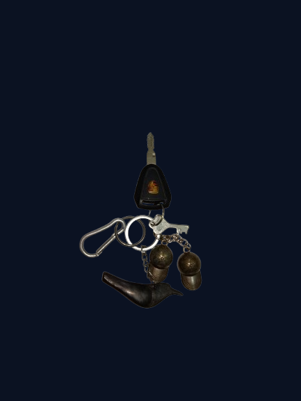

# P Cube – Power Pedal Pro

An Affordable Electric Bicycle Conversion Kit

## Overview

The P Cube - Power Pedal Pro (PPP) is an innovative electric bicycle conversion kit designed to transform traditional bicycles into powerful, electrically assisted modes of transportation. This project emerged from a personal need to create an affordable alternative to expensive ready-made electric bicycle conversion kits available in the market.

This documentation serves as a comprehensive technical portfolio showcasing the entire journey of the P Cube project—from initial conception during a summer break, through hands-on development and real-world testing over two years, to the final refined product.

## Key Features

- **Affordability**: Complete kit at ₹7,000, eliminating hidden costs associated with competing products
- **Environmental Sustainability**: Utilizes recycled materials including UPS batteries, truck lighting, and repurposed mechanical components
- **Seamless Integration**: Designed specifically for standard bicycle frames without permanent modifications
- **Dual-Mode Operation**: Supports pedal-only, motor-only, and hybrid (pedal + motor) operation simultaneously
- **User-Friendly Interface**: Intuitive throttle control with battery monitoring via voltmeter display
- **Enhanced Safety**: 24W headlight for low-light visibility, key-lock security system, and waterproof electronics enclosure
- **Weather Protection**: Integrated protective cover for all electrical components, extending lifespan in varying weather conditions
- **Universal Charging**: Standard 220V outlet charging using universal Philips connector, avoiding proprietary systems

## Specifications

- **Motor Power**: 250W / 24V
- **Hybrid Speed**: 45 km/h
- **Total Project Cost**: ₹7,000 – 8,500

## Project Objectives

- Develop an affordable electric bicycle conversion kit priced at ₹7,000, including all essential components
- Demonstrate sustainable engineering through the use of recycled materials from discarded electronics and vehicles
- Create a seamless integration system that transforms traditional bicycles without aesthetic or functional compromise
- Achieve reliable performance through hands-on testing over an extended period (2+ years)
- Provide a complete solution with integrated safety features, protective covers, and user-friendly controls

## Documentation Sections

- [Introduction](Docs/Introduction.md)
- [Background Story](Docs/Background.md)
- [Problem Statement](Docs/Problem_Statement.md)
- [Project Overview](Docs/Project_Overview.md)
- [Design and Components](Docs/Design_and_Components.md)
- [Hardware Specifications](Hardware/Hardware_Specifications.md)
- [Technical Challenges and Solutions](Docs/Technical_Challenges.md)
- [Design Evolution and Improvements](Docs/Design_Evolution.md)
- [Performance Metrics](Docs/Performance_Metrics.md)
- [Safety and Durability](Docs/Safety_and_Durability.md)
- [Component Failures and Lessons Learned](Hardware/Component_Failures.md)
- [Cost Analysis](Docs/Cost_Analysis.md)
- [Future Development](Docs/Future_Development.md)
- [Key Achievements](Docs/Key_Achievements.md)
- [Conclusion](Docs/Conclusion.md)

## Author

Ayushman Sahoo - A Personal Engineering Project Based on Hands-On Innovation and Sustainable Technology
